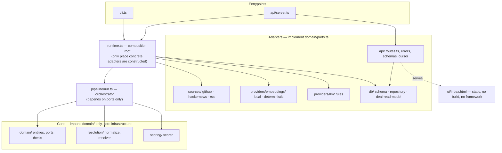

# Deal Signal Engine

Ingests startup signals from public sources, resolves duplicate mentions into single companies, and ranks them against a configurable investment thesis — for an early-stage VC analyst who wants a defensible, auditable long-list instead of a manual spreadsheet.

## The problem

Early-stage sourcing is a funnel problem before it's an investing problem. An analyst covering "devtools, seed stage" doesn't lack deal flow — HackerNews, GitHub, and tech press collectively mention thousands of companies a month. What they lack is time: reading every "Show HN", skimming every launch post, and manually cross-referencing a GitHub repo against a TechCrunch article about the same startup under a slightly different name does not scale past a handful of sources, and it happens *before* the interesting analytical work (does this fit the thesis?) even starts.

The two failures that make this expensive aren't obvious ones. First, the same company shows up multiple times under different names, capitalizations, and legal suffixes across sources — "Acme Inc." on GitHub, "acme.com" in a press release, "Acme" in an HN comment — and treating those as three separate leads doesn't just waste review time, it silently under-counts a company's actual momentum by splitting its signal across three phantom entities. Second, "does this fit the thesis" is not a single filter — it's a weighted judgment across sector, stage, semantic fit, and how much is genuinely *happening right now* versus in the past — and doing that judgment by hand, consistently, across hundreds of candidates a week, is where an analyst's actual expertise gets buried under repetitive triage instead of spent on the 10 companies that clear the bar.

This project automates exactly those two failures — entity resolution and thesis-weighted scoring — while keeping every score auditable back to the source record that produced it. It intentionally does not automate the judgment call itself: the output is a ranked, evidence-linked long-list for a human to review, not an auto-invest signal.

## Demo

Real output from this project's own verification run — a live pipeline run against real HackerNews, GitHub, and RSS sources, no fixtures, no fabricated numbers.

**CLI** (`npm run pipeline -- --thesis thesis.example.yaml`), top of a real 37-company ranked run:

```
Run 4d5d2679-b80c-41dc-a3db-8d3ce0c71074 finished — status: completed

1. India's Yulu raises $93M as quick-commerce boom fuels e-bike demand — score 62.2 [merge_incierto, etapa incierta]
   India's Yulu raises $93M as quick-commerce boom fuels e-bike demand scores 62/100 against the "Dev tools B2B, etapa temprana" thesis, driven mostly by recent momentum and semantic fit with the thesis. Component contributions (points out of 100): semantic 23, momentum 30, keywords 0, recency 10. Merged from multiple source records with only moderate confidence ('merge_incierto').
2. General Catalyst leads $1.1B round into 2-month-old River AI — score 61.8 [merge_incierto, etapa incierta]
   General Catalyst leads $1.1B round into 2-month-old River AI scores 62/100 against the "Dev tools B2B, etapa temprana" thesis, driven mostly by recent momentum and semantic fit with the thesis. Component contributions (points out of 100): semantic 24, momentum 28, keywords 0, recency 10. Known context — sector ai; merged from multiple source records with only moderate confidence ('merge_incierto').
3. AI code-testing startup Blacksmith's valuation jumps almost 10x in less than a year — score 61.2 [merge_incierto, etapa incierta]
   ...
```

**API** (`npm run serve`, then real `curl` against the running server):

```
$ curl -s http://localhost:3000/health
{"status":"ok"}

$ curl -s "http://localhost:3000/deals?limit=3"
{
  "runId": "4d5d2679-b80c-41dc-a3db-8d3ce0c71074",
  "items": [
    {
      "companyId": "6ceda58b-c29a-4b6e-9c12-f005740d941a",
      "canonicalName": "India's Yulu raises $93M as quick-commerce boom fuels e-bike demand",
      "score": 62.17864904094692,
      "breakdown": {
        "semantic": { "value": 0.5646021139390456, "weight": 0.4 },
        "momentum": { "value": 0.9864864864864865,  "weight": 0.3 },
        "keywords": { "value": 0, "weight": 0.2 },
        "recency":  { "value": 0.99999698887905,    "weight": 0.1 }
      },
      "rationale": "India's Yulu raises $93M ... scores 62/100 ..., driven mostly by recent momentum and semantic fit with the thesis. ...",
      "flags": ["merge_incierto", "etapa incierta"]
    }
    /* 2 more items in the real response, omitted here for brevity */
  ],
  "cursor": "eyJzY29yZSI6NjEuMTg1NjUwNjQ2NDg2MiwiY29tcGFueUlkIjoiNWViYjhhYTgtOTUzNi00ODkyLWJmNDAtNjY5MTQ3NDVlYTUyIn0"
}

$ curl -s "http://localhost:3000/companies/6ceda58b-c29a-4b6e-9c12-f005740d941a/provenance"
{
  "companyId": "6ceda58b-c29a-4b6e-9c12-f005740d941a",
  "fields": [
    { "field": "canonicalName", "method": "reconstructed-from-source-precedence", "source": "rss", ... },
    { "field": "sector", "method": "enrichment-not-attributable" }
  ]
}
```

`0.4×0.5646 + 0.3×0.9865 + 0.2×0 + 0.1×1.0 = 0.6218` → `score 62.18` — the score is independently recomputable from the returned `breakdown`, by design.

`GET /ui` serves the framework-free ranked table (sortable, each row expandable to the same breakdown/rationale/evidence). No screenshot is included here — the JSON above is the same data the UI renders, verified against the real running server rather than a static image.

## Quickstart

```bash
docker compose up -d
npm i
npm run db:migrate
npm run pipeline -- --thesis thesis.example.yaml
```

No API keys, no `.env` file, no manual setup beyond Docker. Optionally, in a second terminal: `npm run serve` then open `http://localhost:3000/ui`.

**Verified twice for this phase**: once in-place against this checkout with a freshly emptied database (the run in the Demo section above), and once against a genuinely fresh `git clone` into an empty directory — `npm i` (218 packages, clean install), `docker compose up -d` + `npm run db:migrate` (fresh pgvector volume, migrations apply cleanly, zero manual steps), confirmed with zero environment variables set either time.

## Architecture



Ports-and-adapters (hexagonal), enforced two ways, not just by convention. First, dependency direction: `domain/`, `resolution/`, and `scoring/` import nothing but `domain/` — no Postgres, no transformers.js, no Hono, no Node builtins. Second, that rule is **machine-checked**, not aspirational: `eslint.config.js` bans exactly those imports inside those three directories via `no-restricted-imports`, so a core-layer file that reaches for `postgres` or `fs` fails `npm run lint`, not just code review. `pipeline/run.ts` is the orchestrator — it depends on the `CompanyRepository`/`SourceAdapter`/`EmbeddingProvider`/`LlmProvider` **ports** (interfaces in `domain/ports.ts`), never a concrete class, which is what makes the in-memory test doubles in `tests/doubles/` a drop-in replacement for real Postgres with zero pipeline-code changes.

One real deviation from an earlier design sketch, disclosed rather than hidden: enrichment (spec-described as its own module) is not a separate `enrichment/` directory in the current tree — it lives inside `providers/llm/rules.ts`'s `enrich()` method instead, because the actual enrichment logic (a small keyword-in-text sector guess) never grew complex enough to justify its own module. Adding a source requires touching no file under `domain/`, `resolution/`, or `scoring/` — verified structurally: `sources/rss.ts` was added after `resolution/` and `scoring/` were already complete, and neither needed a change.

## The three algorithms

### 1. Entity resolution (`resolution/normalize.ts`, `resolution/resolver.ts`)

**Normalize** → **block** → **weighted pair score** → **union-find merge**.

Normalization strips accents, corporate suffixes (Inc/LLC/SA/SRL/GmbH...), and punctuation from names; domains are reduced to their *registrable* domain via the `psl` library (a real Public Suffix List), not a naive "last two labels" heuristic. That distinction is not academic — a naive heuristic truncates `acme.co.uk` down to `co.uk`, silently colliding it with every other unrelated `.co.uk` company. This was a real bug, caught by review during this build, fixed by switching to `psl`.

Blocking avoids full pairwise comparison: only records sharing an exact domain, the first 4 characters of the normalized name, or a name trigram are ever compared — never O(n²) across the whole batch.

Compared pairs get a weighted score: **domain match 0.5** (dominant, but not unilaterally decisive), name similarity (hand-rolled Jaro-Winkler) 0.25, embedding cosine 0.15, shared person 0.10. Scores ≥0.82 auto-merge, 0.55–0.82 merge with a visible `merge_incierto` flag, below 0.55 stay separate. Accepted pairs collapse transitively via union-find, so A≈B and B≈C merge A/B/C into one company even though A≈C was never directly scored.

**Real example** (from this project's own 32-pair golden test, `tests/golden/entity-resolution.golden.test.ts`): "Vercel" (`vercel.com`) vs. "Verceld" (`verceld.io`) — near-identical names, but genuinely different companies. Domain doesn't match, so despite the name similarity the pair scores **0.367**, confidence `none` — correctly *not* merged. Domain being "dominant" does not mean domain-plus-similar-name auto-merges regardless of everything else; it means domain carries half the weight, not all of it.

**Golden test result, run live for this phase**: 32 hand-labeled pairs (16 true matches, 16 non-matches) → confusion matrix TP=16 FP=1 FN=0 TN=15 → **precision 0.941, recall 1.000**.

### 2. Thesis scoring (`scoring/scorer.ts`)

Hard filters run first and short-circuit to `score = 0` — a company outside the thesis's allowed stages or inside an excluded sector never reaches the weighted computation, verified directly in the scorer: only `survivors` (post-filter companies) are passed to `embeddings.embed()`, so a hard-filtered company never even triggers an embedding call.

For survivors: `score = 100 × (0.4×semantic + 0.3×momentum + 0.2×keywords + 0.1×recency)` (weights come from the thesis YAML, not hardcoded). Semantic is cosine similarity between the company's text and the thesis's text (local MiniLM, 384-dim). Momentum is log-transformed signal velocity, **percentile-ranked within the run** — the same company's momentum score depends on which other companies are in the same batch, by design (a batch of exactly 1 always yields the median, 0.5 — there's nothing to compare against). Keywords is soft-preference coverage minus an anti-pattern penalty. Recency is exponential decay from `firstSeenAt` with a 30-day half-life.

**Real example**, from the live run above: `100 × (0.4×0.5646 + 0.3×0.9865 + 0.2×0 + 0.1×1.0) = 62.18` — matches the returned `score` exactly; every `ScoredDeal.breakdown` is independently recomputable, not just a black-box number.

### 3. Rationale generation (`providers/llm/rules.ts`)

Deterministic, template-based, built from the exact same `breakdown` the score comes from — zero LLM calls, zero cost, and the same input always produces byte-identical output (no `Math.random()`, no wall-clock reads in the code path). It names the dominant component(s) by weighted contribution, surfaces sector/stage when known, and is honest about `merge_incierto`/hard-filter reasons rather than hiding them behind generic praise.

**Real example**, same company as above: *"India's Yulu raises \$93M... scores 62/100 against the "Dev tools B2B, etapa temprana" thesis, driven mostly by recent momentum and semantic fit with the thesis. Component contributions (points out of 100): semantic 23, momentum 30, keywords 0, recency 10. Merged from multiple source records with only moderate confidence ('merge_incierto')."*

This is the load-bearing default, not a stub: the pipeline runs fully and sensibly with zero LLM configured. An LLM-based rationale provider is a pluggable upgrade behind the same `LlmProvider` interface (`LLM_PROVIDER=ollama` fails fast today — unimplemented, not silently downgraded), never a requirement.

## Decisions and trade-offs

| Decision | Chosen | Why / trade-off |
|---|---|---|
| Embeddings: local vs. API | Local (`transformers.js`, MiniLM, 384-dim) | Zero cost, zero external dependency, works offline after a one-time ~90MB download — at the cost of lower quality than a hosted embedding API |
| Rationale: rules vs. always-LLM | Rules-based (deterministic templates) | Zero cost, testable, byte-reproducible; any LLM is an optional upgrade behind `LlmProvider`, never a dependency |
| Vector store: Postgres+pgvector vs. dedicated vector DB | Postgres+pgvector | One fewer service to run for a project this size; the `ivfflat` index logs a real low-recall NOTICE until the table has meaningfully more rows — a genuine limit of this choice at larger scale |
| UI: static HTML vs. Next.js | Static HTML, zero build step | Keeps the bootstrap truly zero-config and framework-free per spec; trades away a real component model — see Roadmap |
| Entity-resolution comparison: blocking vs. all-pairs | Blocking (domain / name-prefix / trigram) | O(n)-practical instead of O(n²); accepts a small, deliberate risk of missing a match sharing zero blocking key |
| Deploy: SST sketch vs. real AWS deploy | `sst.config.ts`, explicitly unapplied | Shows the intended shape (Lambda + RDS/Aurora pgvector + EventBridge cron) at zero AWS cost; not a tested deployment |
| Domain normalization: `psl` vs. naive heuristic | `psl` (real Public Suffix List) | Caught and fixed a real bug: a naive "last two labels" heuristic collided distinct `.co.uk` companies into a false merge |
| `SourceRecordRepository` read shape | No `run_id` partitioning on `listByRun` | The schema doesn't partition `source_records` per run — ingestion accumulates continuously. An earlier port sketch assumed otherwise; caught and corrected during review |
| `CompanyRepository.merge()` | Non-destructive redirect via `mergedInto` | Never deletes or unions data — the pipeline orchestrator follows merge chains itself; reversible by construction, at the cost of read-side complexity |
| GitHub stargazer signal | Degrade gracefully, never fabricate | GitHub restricted the timestamped-stargazers endpoint to admins/collaborators mid-build (a real, live platform change) — the adapter keeps the absolute `github_stars` count and omits the delta rather than reporting a false zero |

## Scale — what changes at 100x volume

- **Ingestion**: today's `Promise.allSettled` fan-out across 3 sources becomes a bottleneck past a handful of sources at high volume. It would move to per-source queues (e.g. one SQS queue per `SourceAdapter`) so a slow/rate-limited source never blocks the others, and so the ingest step can scale horizontally instead of running in a single process.
- **Entity resolution**: `pipeline/run.ts` resolves each newly-ingested record sequentially against live repository state — a deliberate simplification for the incremental, record-at-a-time shape the pipeline has today (by the time record #2 is resolved, record #1's company is already persisted and visible to the next lookup, so no separate batch pass is needed at this scale). `resolution/resolver.ts` already exports the batch primitive this doesn't use — `mergeClusters()`, a full union-find clustering pass over accepted pairs, built and unit-tested but currently unreferenced by the pipeline. At 100x volume this would flip: build an inverted index from blocking keys instead of one `findByBlockingKeys` query per incoming record, generate all candidate pairs in one pass, then call the *existing* `mergeClusters()` once over the whole batch.
- **Embeddings**: `buildCompanyEmbeddingText`/`buildThesisEmbeddingText` are called fresh every run. A hash-of-text → embedding cache (keyed by a stable hash of the input text) would skip re-embedding a company whose description hasn't changed since the last run — the actual embedding call, not the log/db I/O around it, is this project's real cost bottleneck at volume.

## Known limitations

Disclosed honestly — these are real, not modesty padding:

- **GitHub stargazer timestamps**: the `stargazers` endpoint with per-star timestamps (used for `github_stars_delta_30d`) was restricted by GitHub to repo admins/collaborators partway through this build. Confirmed live during this phase's own verification (real `HTTP 401` responses against real repos). The adapter degrades gracefully — keeps the absolute `github_stars` count, omits the delta, never fabricates a false zero — but the momentum signal for GitHub-sourced companies is weaker than originally designed as a direct result.
- **GitHub unauthenticated rate limit**: confirmed live in this phase's own testing — after enough real requests in one session, the token bucket empties and the adapter correctly *waits for reset* rather than exceeding the ceiling or failing (per spec), which is correct behavior but means back-to-back full pipeline runs against live GitHub within the same hour can be slow. Setting `GITHUB_TOKEN` raises the ceiling.
- **RSS name extraction is noisy**: RSS headlines get parsed as company names with no NLP, so a real headline like *"Investors sue Selena Gomez alleging fraud tied to her mental health startup"* becomes a `canonicalName` — not a company name at all. Confirmed live: this exact string is real output from this phase's own verification run. Entity resolution's fuzzy matching has to compensate for this noise; it isn't filtered upstream.
- **`ivfflat` index, low recall on a near-empty table**: Postgres logs a real NOTICE ("This will cause low recall... Drop the index until the table has more data") on every fresh migration — an honest operational fact about this index type at low row counts, not a bug.
- **No write-time field provenance**: `/companies/:id/provenance` is a **read-time reconstruction** (re-running the same source-precedence conflict resolution used at merge time), not a stored audit log — there is no `field_history` table. It's honest about this: every field in the response is tagged `method: 'reconstructed-from-source-precedence'` or `'enrichment-not-attributable'`, never overclaiming certainty the schema doesn't store.
- **`RunRepository`'s `'failed'` path**: correctness-by-inspection rather than dedicated test coverage — the catastrophic "the whole run threw" path is thin on automated tests relative to the `completed`/`partial` paths.
- **A real stored-XSS was found and fixed during review**: RSS `<link>` elements flowed unvalidated into evidence URLs rendered by the UI. Fixed with scheme validation at both ingestion time and render time (defense in depth) — disclosed here because catching and fixing it is a better signal than pretending it never happened.

## Roadmap

- **Paid sources**, designed for but intentionally excluded from this build: PitchBook, Crunchbase, Harmonic, Affinity, LinkedIn — all fit behind the existing `SourceAdapter` interface with zero core-layer changes, the same way `rss.ts` was added after the fact.
- Auth and multi-tenancy (today: single analyst, no accounts).
- A real Next.js frontend, replacing the static `/ui` (see "Decisions and trade-offs").
- A real AWS deployment applying `sst.config.ts` for real, with the two Lambda handler shims it currently only sketches.
- A production scheduler for recurring pipeline runs, replacing the `sst.config.ts` sketch's placeholder daily cron cadence with a researched one.
- The optional MCP server (`search_companies`, `get_company_provenance`, `score_against_thesis`) — explicitly droppable scope, not built in this phase.
